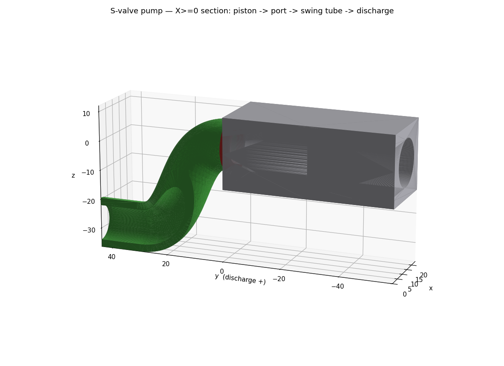

# Twin-cylinder S-valve pump (solids-handling)

A **parametric, 3D-printable positive-displacement pump** that moves fluids carrying
suspended solids — here **glass reflective beads in mineral oil** — without clogging.
It borrows the concrete-pump trick: the only "valve" is a **fat swinging tube** whose
bore is far bigger than any bead, so there is no small orifice or seat to jam. Built in
[build123d](https://github.com/gumyr/build123d), same conventions as the valve blocks.

See [`PUMP_BRIEF.md`](PUMP_BRIEF.md) for scope/decisions.



## How it works

```
        hopper (open top, holds the bead-oil slurry, contains the S-tube)
   ┌──────────────────────────────────────────┐
   │   ●(-X port)            ●(+X port)         │  wear plate (y=0), two ports
   │        ╲                 ╱ ← S-tube mouth + TPU wear ring covers ONE port
   │         ╲_______________╱                  │
   │          (      S       ) gooseneck        │
   │           ╲____________╱                   │
   │             ▼ pivot = discharge axis ──────┼──► out
   └─────────────╫──────────────────────────────┘
   behind plate: two cylinders (bores along Y)
       piston ◄──┤├──► piston      ← 180° out of phase
                 ││
            conrods ─► ONE crankshaft ◄─ swing eccentric ─► rocks the S-tube
```

- **Two cylinders, 180° out of phase.** While one piston pushes slurry out through its
  port, the other retracts and **draws fresh slurry from the hopper** through its
  (uncovered) port. Output is near-continuous.
- **The S-tube is the whole valve.** Its outlet end is a fixed pivot on the discharge
  axis; its inlet **mouth swings** across the wear plate to cover exactly one port at a
  time. Because the mouth rides a circle centered on the pivot axis, and the plate is
  perpendicular to that axis, the mouth stays flat in the plate plane at **every** swing
  angle — one rigid tube seals two ports. Verified in `pump_assembly.py`: the swung
  mouth lands on the port at x=12.0, z=0.0.
- **Why it eats beads:** every bead-wetted passage — bore, port, tube — is ≥ **4× the
  design-max bead** (`pump_params.py` asserts `min_passage ≥ SAFETY × BEAD_D` at import,
  so the design *cannot* build if a passage is too narrow). Real glass reflective beads
  are much smaller than the 3 mm ceiling, so the margin is enormous.
- **Self-sealing wear ring.** A replaceable **TPU wear ring** on the mouth is pressed
  onto the plate by the discharge pressure itself. Mineral oil helps twice: it is
  viscous (keeps beads suspended, fills printed clearances) and lubricating (glass-in-oil
  grinds the seal far less than glass dry or in water). The ring is the designated wear
  item — print spares and swap it, exactly like the valve's `tpu_disc`.
- **One motor runs everything.** A single crankshaft reciprocates both pistons and, off a
  third eccentric, rocks the S-tube in time — no separate swing actuator.

## Parts

| Module | Output | Material |
|---|---|---|
| `cad/pump_params.py` | source of truth (dims, kinematics, `place()`, clog guard) | — |
| `cad/cylinder_block.py` | twin-cylinder body + wear plate + 2 ports | SLA rigid resin |
| `cad/s_tube.py` | swing tube (the S-valve) | SLA rigid resin |
| `cad/wear_ring.py` | replaceable mouth face seal | **FDM TPU ~95A** |
| `cad/piston.py` | piston (O-ring gland + conrod clevis) ×2 | SLA rigid resin |
| `cad/crankshaft.py` | single drive shaft (2 throws + swing eccentric) | printed or metal rod |
| `cad/pump_assembly.py` | full + X≥0 section render (STL + PNG) | — |

Dimensions chain from `pump_params.py` (like the valves' `interface.py`): change one
constant, rebuild, and every part + the assembly re-fit. Connecting rods and the swing
pushrod are drawn at assembly time as reference links between the crank pin centers.

## Build

```bash
make pump        # build all pump parts + assembly/section renders into build/
make             # build the valve stack AND the pump
python3 cad/pump_params.py    # print the clog-safety report (min passage vs bead)
```

Each part script prints a sanity line (bbox, body count, watertight). The assembly prints
a manifest, the swing-registration proof, and a bbox trip-wire. Renders are snapshotted to
`cad/renders/pump/` (a dated visual changelog — see its `INDEX.md`).

## Print, assemble, bench-test

**Materials / hardware (bench scale, default params):**
- Rigid parts (block, S-tube, pistons): **SLA** rigid resin (smooth bores/seal faces).
- Wear ring: **TPU ~95A** (FDM) or flexible SLA resin — must be an elastomer to seal.
- Per piston: an O-ring (~Ø12 × 2 mm CS) for the gland, a wrist pin, a connecting rod.
- Crankshaft: print it, or use a metal rod with printed cheeks for stiffness.
- A geared **DC/BLDC motor** (mineral oil is viscous → give yourself torque headroom).
- **Mineral-oil compatibility check (do before soaking):** PETG, TPU, and fully-cured
  SLA resin are generally fine with mineral oil; verify your specific resin/filament
  (soak a coupon for a few days and check for swelling/softening) before long runs.

**Bench test:**
1. Turn the crank **by hand** first, dry: confirm the pistons reciprocate 180° apart and
   the S-tube rocks fully onto each port at the piston dead-centers (this is the timing to
   get right — see below).
2. Fill the hopper with plain **mineral oil** (no beads yet). Hand-crank and confirm it
   primes and moves oil out the discharge with no leaks at the wear ring or walls.
3. Add **glass beads** to the slurry and repeat — watch for smooth, clog-free discharge.
   Then couple the motor.

## Drive timing — simulated (the risky bit)

The riskiest open question was whether a **single crankshaft** can rock the S-tube so its
mouth stays sealed on the *discharging* cylinder's port for that whole stroke. The MuJoCo
bench `sim/pump_sim.py` plays the real CAD meshes through the crank kinematics (imported
from `pump_params.py`) and measures **port coverage** — how far the mouth sits from the
discharging port vs crank angle.


**Two findings — both change the drive design:**

1. **A plain eccentric will not do — you need dwell.** A simple crank eccentric gives
   *sinusoidal* swing: the mouth lines up on the port only for an instant at mid-stroke and
   is badly misaligned (up to ~12 mm) at the stroke ends — the discharging cylinder leaks
   back to the hopper most of its stroke. Quantified: the discharging port is sealed only
   **~41 %** of the cycle with a sine profile, vs **~82 %** with a dwell profile (parks the
   mouth on the port, flips fast at the dead centers where piston velocity ≈ 0 so little
   flow is lost). Run it: `make mujoco` (interactive), `make mujoco-demo` (gif + figure).
2. **The swing axis is perpendicular to the crank axis.** The crankshaft turns about **X**
   but the S-tube swings about **Y**, so a single in-plane pushrod *cannot* couple them
   (the schematic pushrod in the CAD render is exactly that — schematic). The swing needs a
   **right-angle take-off**: a bevel/crown gear driving a crank coaxial with the S-tube
   pivot, or a **dwell cam** on the crankshaft with a follower. The cam is attractive
   because it can bake the dwell profile from finding (1) directly into its shape.

**Design implication:** drive the pistons off the crankshaft as planned, but drive the
swing with a **dwell cam** (or an indexing mechanism) coaxial-ish with the pivot — not a
plain eccentric + pushrod. Widening the ports into **kidney slots** along the swing arc
buys extra overlap margin on top of the dwell.

## Status & next

Working first slice: block + swing S-tube + TPU wear ring + pistons + single crankshaft,
all watertight; the section proves the bead-safe flow path; the swing geometry is verified;
and the drive timing is simulated (above).

**Next, roughly in order:**
1. **Design the swing dwell mechanism** — a cam profile (or bevel-gear + rocker) that
   realizes the ~square-wave dwell the sim showed is needed, with a right-angle take-off
   from the crankshaft. Then re-sim to confirm ≥ ~90 % sealed.
2. **Hopper** — an open-top shell in front of the plate that holds the slurry and houses
   the swinging tube (its own part; currently omitted so the mechanism is visible).
3. **Discharge rotary seal** — a fixed collar the S-tube's discharge stub spins in.
4. **Kidney ports** — elongate the plate ports along the swing arc for overlap timing
   (round ports work; kidneys smooth the changeover).
5. **Scale to your beads** — set `BEAD_D` to your real bead size and rebuild; the clog
   guard keeps every passage safe automatically.

## Safety

Mineral oil is combustible (high flash point) and messy — this is **not** a food-safe or
pressure-rated device. Bench/art use at low head only. Contain spills; glass beads in oil
are slippery. If you ever swap to a volatile carrier, reassess everything.
