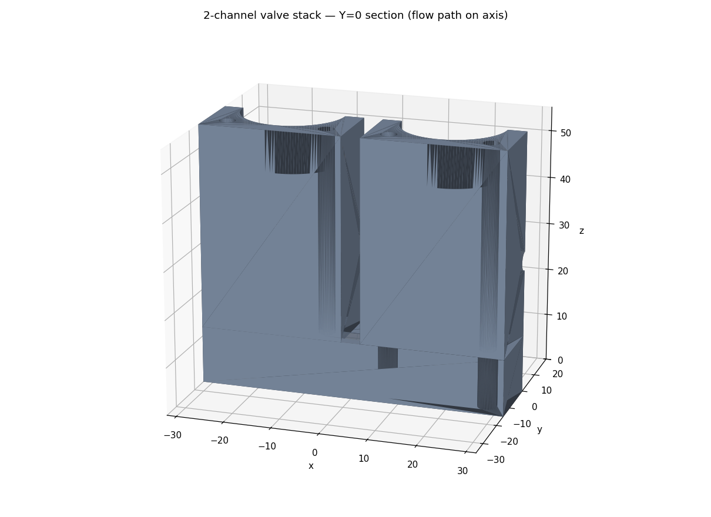

# 3dp-valves

A **parametric, 3D-printable solenoid valve & manifold system** for compressed gas —
shop air and (regulated, low-pressure) propane/butane for flame effects, plus pneumatic
cylinder control. Fluid schematics are modeled as composable solid parts in
[build123d](https://github.com/gumyr/build123d) and exported as clean, watertight STLs.

The idea: replace expensive miniature gas valves and manifolds with cheap printed blocks
that share a standard mating-face **port interface** (port + TPU gasket groove + bolt
pattern), so manifold configurations are assembled from composable blocks.



## Design

A single channel is a **direct-acting, normally-closed poppet valve**:

```
  bottom inlet ─► orifice ─► seat land ─► chamber ─► outlet (+X)
                                  ▲
              TPU disc on poppet seals the seat; a return spring holds it
              closed; a 12V push-pull solenoid lifts it open.
```

- **Direct-acting** (coil force only) — required for low-pressure / low-differential gas.
- **Normally-closed** — fail-safe (de-energized = shut).
- **Magnetic gap is smallest at the seated position**, where seating force is needed most.

See [`BRIEF.md`](BRIEF.md) for scope, [`RESEARCH.md`](RESEARCH.md) for solenoid/valve
selection and the duty-cycle / direct-vs-pilot reasoning, and
[`PRINT_AND_TEST.md`](PRINT_AND_TEST.md) for materials and the pressure-test procedure.

## Parts

| Module | Output | Material |
|---|---|---|
| `cad/interface.py` | shared port interface (constants, bolt pattern) | — |
| `cad/solenoid_block.py` | single valve body block | SLA rigid resin |
| `cad/poppet.py` | moving poppet | SLA rigid resin |
| `cad/tpu_disc.py` | flat sealing gasket | **FDM TPU ~95A** |
| `cad/manifold.py` | 1-inlet → 2-channel supply manifold | SLA rigid resin |
| `cad/assembly.py` | full + Y=0 section render (STL + PNG) | — |

Dimensions are chained by imports (`tpu_disc → poppet → solenoid_block → interface ←
manifold`), so changing one interface constant and rebuilding keeps every part in sync.

## Build

```bash
pip install build123d trimesh           # + matplotlib for the section PNG
python3 cad/solenoid_block.py           # -> build/solenoid_block.stl
python3 cad/poppet.py
python3 cad/tpu_disc.py
python3 cad/manifold.py
python3 cad/assembly.py                 # -> build/assembly{,_section}.stl, .png
```

Each script prints a sanity line (bounding box, body count, watertight flag).

## Status

Working MVP: one complete sealed channel + a 2-channel manifold, all watertight.
**Next:** print and pressure-test a single channel at 25 psi before scaling up.

Not yet modeled: the A/B + exhaust 2-way cylinder valve (pneumatics stretch goal) and a
schematic-driven generator that emits manifolds from a flow description.

## Safety

Printed parts for **flammable gas**. Test with **air first**, never debug leaks with fuel
gas, use a regulator + leak detector, and run propane only outdoors with upstream shutoff.
Low-pressure, regulated service only.

## License

MIT
