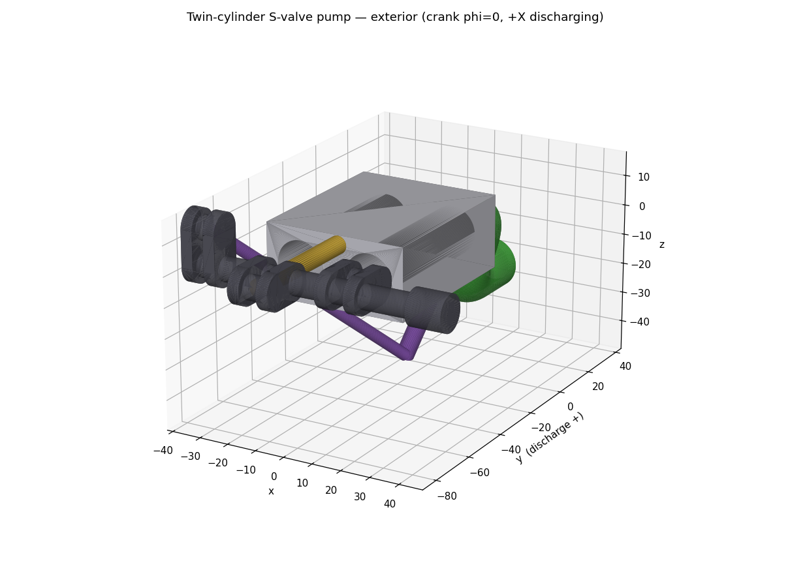

# 3dp-valves

A **parametric, 3D-printable solenoid valve & manifold system** for compressed gas —
shop air and (regulated, low-pressure) propane/butane for flame effects, plus pneumatic
cylinder control. Fluid schematics are modeled as composable solid parts in
[build123d](https://github.com/gumyr/build123d) and exported as clean, watertight STLs.

The idea: replace expensive miniature gas valves and manifolds with cheap printed blocks
that share a standard mating-face **port interface** (port + TPU gasket groove + bolt
pattern), so manifold configurations are assembled from composable blocks.

The repo now has two subsystems:
- **Valves** — direct-acting solenoid poppet valves + manifolds for compressed gas (below).
- **Pumps** — **two versions** of a solids-handling positive-displacement pump for fluids
  full of suspended solids (glass beads in mineral oil): a **horizontal S-valve** pump
  ([`PUMP.md`](PUMP.md)) and a **vertical submersible** rotary-distributor pump
  ([`VPUMP.md`](VPUMP.md)). Both are kept and maintained.


## Design

A single channel is a **direct-acting, normally-closed, pressure-to-close poppet valve**:

```
  inlet (manifold, bottom) ─► -X riser ─► chamber  (supply surrounds the poppet)
                                              │  poppet lifts off the seat
                                              ▼
                                       orifice ─► +X outlet
```

- **Pressure-to-close** — supply fills the chamber and presses the poppet onto the seat,
  so pressure *helps* seal. The return spring is light (just reseats at zero pressure);
  the solenoid opens against P × orifice-area + spring, pulling from the seated position
  where the magnetic gap is smallest and coil force is greatest.
- **Direct-acting** (coil force only) — required for low-pressure / low-differential gas.
- **Normally-closed** — fail-safe (de-energized = shut).
- Tradeoff: the coil sets the max openable orifice (`A_max ≈ F_coil / P`) — generous at
  25 psi propane, tight (~Ø3) at 100 psi air. See [`BRIEF.md`](BRIEF.md).

See [`BRIEF.md`](BRIEF.md) for scope, [`RESEARCH.md`](RESEARCH.md) for solenoid/valve
selection and the duty-cycle / direct-vs-pilot reasoning, and
[`PRINT_AND_TEST.md`](PRINT_AND_TEST.md) for materials and the pressure-test procedure.

## Parts

| Module | Output | Material |
|---|---|---|
| `cad/interface.py` | shared port interface (constants, bolt pattern) | — |
| `cad/solenoid_block.py` | single valve body block | SLA rigid resin |
| `cad/poppet.py` | moving poppet | SLA rigid resin |
| `cad/tpu_disc.py` | flat sealing gasket | **FDM TPU ~95A** |
| `cad/manifold.py` | 1-inlet → 2-channel supply manifold | SLA rigid resin |
| `cad/solenoid_model.py` | reference coil + plunger (for fit only) | **bought, not printed** |
| `cad/assembly.py` | full + Y=0 section render (STL + PNG) | — |

Dimensions are chained by imports (`tpu_disc → poppet → solenoid_block → interface ←
manifold`), so changing one interface constant and rebuilding keeps every part in sync.

## Build

```bash
make deps        # pip install build123d trimesh matplotlib manifold3d
make             # build all parts + assembly/section render into build/
make help        # list targets (parts, assembly, clean, ...)
```

Or run a single script directly, e.g. `python3 cad/solenoid_block.py`. Each script
prints a sanity line (bounding box, body count, watertight flag). The Makefile tracks
the import chain, so editing `interface.py` rebuilds every dependent part.

## Pumps (solids-handling) — two versions

Where the valve blocks are all *small* precision orifices and poppet seats, the pumps are
the opposite — **large, clear, unobstructed passages** so suspended solids (glass beads in
mineral oil) never meet anything smaller than themselves. Both are positive-displacement,
run two cylinders 180° out of phase off one crankshaft, and share the same bead-safe parts
and clog guard (every wetted passage ≥ 4× the design bead, enforced at build). They differ
in orientation and directional valve:

| Version | Directional valve | Shaft | Best for | Port coverage | Docs |
|---|---|---|---|---|---|
| **Horizontal S-valve** | swinging **S-tube** | horizontal crank | bench / open-top hopper | ~41% (plain eccentric → wants a dwell cam) | [`PUMP.md`](PUMP.md) |
| **Vertical submersible** | coaxial **rotary distributor** | vertical shaft | running **submerged** | **~89%** (kidney arc = free dwell) | [`VPUMP.md`](VPUMP.md) |

A MuJoCo timing sim measures the port coverage of each (`sim/pump_sim.py`, `sim/vpump_sim.py`).

### Horizontal S-valve pump

A big swinging **S-tube** alternately connects each cylinder to the discharge — nothing
small to jam. The sim found a plain crank eccentric seals the discharging port only ~41% of
the cycle, so the swing wants a **dwell cam**. Full write-up in **[`PUMP.md`](PUMP.md)**.



```bash
make pump            # build the pump parts + assembly/section renders
make mujoco          # interactive timing sim (watch the swing track the ports)
```

### Vertical submersible pump

The vertical shaft makes the directional valve a **rotary distributor** coaxial with the
drive, which gives the dwell for free (**~89%** of the cycle sealed). Opposed cylinders,
90° up-piping, output riser to the surface. Full write-up in **[`VPUMP.md`](VPUMP.md)**.


```bash
make vpump           # build the vertical submersible pump + renders
make vmujoco         # interactive timing sim of the rotary distributor (~89% coverage)
```

## Status

- **Valves:** working MVP — one complete sealed channel + a 2-channel manifold, all
  watertight. Next: print and pressure-test a single channel at 25 psi.
- **Pumps:** **two** working versions kept side by side — the horizontal S-valve pump
  ([`PUMP.md`](PUMP.md)) and the vertical submersible rotary-distributor pump
  ([`VPUMP.md`](VPUMP.md)). All parts watertight, timing simulated for both. Open details
  (dwell cam / rotary-union seal, hopper, bench test) are tracked in their docs.

Not yet modeled: the A/B + exhaust 2-way cylinder valve (pneumatics stretch) and a
schematic-driven manifold generator.

## Safety

Printed parts for **flammable gas**. Test with **air first**, never debug leaks with fuel
gas, use a regulator + leak detector, and run propane only outdoors with upstream shutoff.
Low-pressure, regulated service only.

## License

MIT
