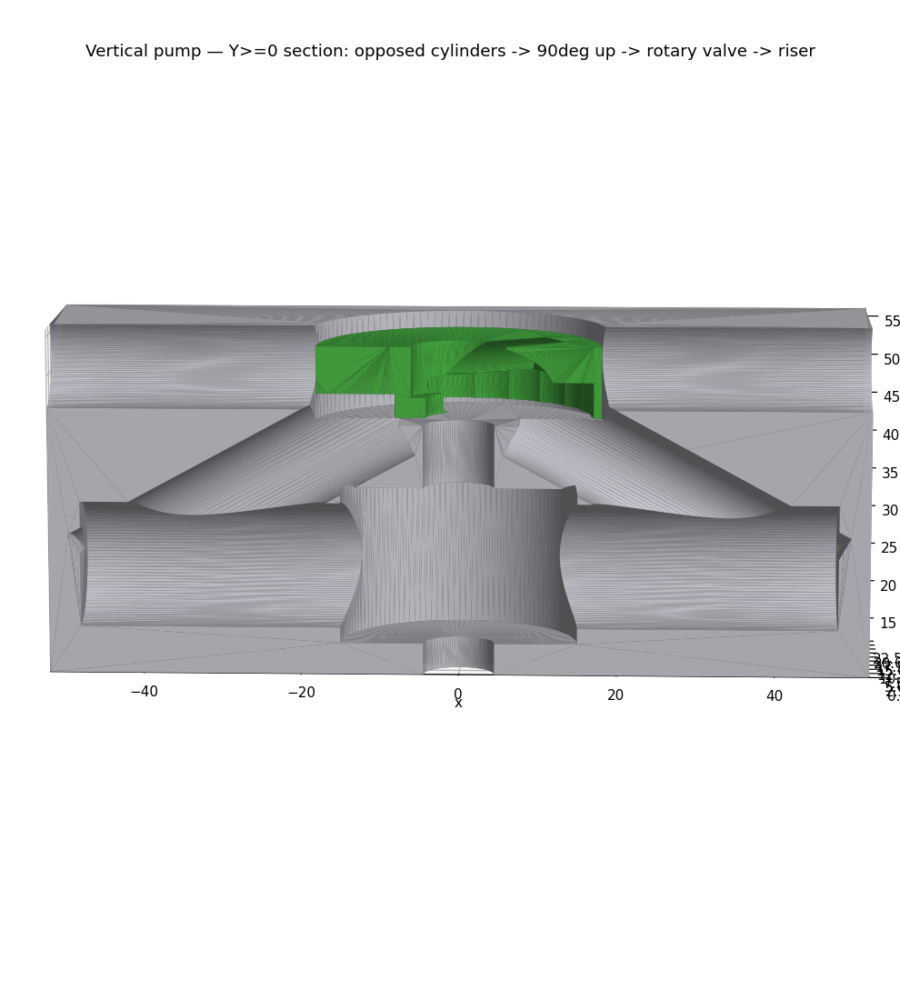
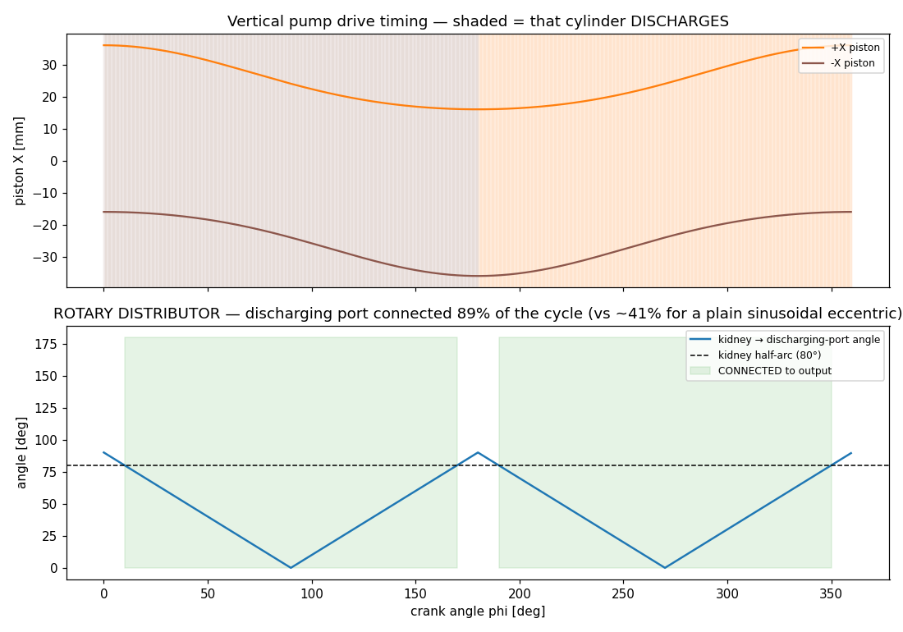

# Vertical submersible S-valve pump (rotary distributor)

A **vertical-shaft variant** of the [twin-cylinder pump](PUMP.md), built to run **submerged**
with the drive shaft vertical. Re-orienting the shaft to vertical makes the directional
valve **coaxial** with the drive — so the "cam" that alternates the output becomes a
**rotary distributor** turning on the same shaft. That change also solves the horizontal
pump's timing problem for free: a continuously-rotating distributor is a square-wave
selector, so it holds the **dwell** the [sim](PUMP.md#drive-timing--simulated-the-risky-bit)
showed a plain eccentric can't.



## How it works (bottom → top)

```
                    ▲ output riser (up to the surface, past the waterline)
                    │
         ┌──────────┴──────────┐  valve chamber
         │      [ROTOR]        │  rotary distributor keyed to the shaft:
         │   kidney → riser    │   ~160° kidney routes the DISCHARGING port up to the
         │   relief → bath     │   riser; opposite relief opens the OTHER port to the bath
         ├─────────┬───────────┤  valve plate: 2 ports (±X), 180° apart
   port ─┤  90° up-gallery     ├─ port      each cylinder's outer port turns UP + inward
         │         │           │
   [===piston→]  shaft  [←piston===]  two OPPOSED cylinders (bores along X), ports outward
         │   crank throw       │   one shared crank throw drives both, 180° out of phase
         └─────────┬───────────┘
                   │ shaft
                   ▼ motor coupling (sealed, at the bottom)
```

- **Vertical shaft, opposed cylinders.** Two collinear cylinders (bores along X) share one
  crank throw, so their pistons run 180° out of phase — one discharges while the other
  draws from the bath. Opposed (rather than side-by-side) because a *central* vertical shaft
  makes collinear cylinders a clean, zero-offset slider-crank with ports that land **180°
  apart** on the valve plate — exactly what the rotary distributor wants.
- **Rotary distributor = the "cam".** A rotor keyed to the shaft carries a ~160° **kidney**
  on its underside. As it turns, the kidney connects whichever port is discharging up
  through the rotor's central bore to the **riser**, while an opposite **relief** opens the
  other port to the bath for suction. No poppets, no check valves — nothing small to clog.
- **Dwell for free.** Because the kidney is a 160° arc, the discharging port stays connected
  for ~160° of every 180° stroke: **~89% of the cycle sealed** (`python3 cad/vpump_params.py`),
  versus **~41%** for the horizontal plain eccentric. The ~20° gaps land at the dead centers,
  where piston velocity ≈ 0 and little flow is lost.
- **90° internal piping.** Each cylinder's horizontal discharge turns **up** to the coaxial
  valve, so the output leaves **vertical — 90° to the cylinders** — and rises out of the fluid.
- **Submersible.** The whole body runs under the fluid; the un-selected cylinder simply
  draws from the surrounding bath (vent to the valve chamber). Every bead-wetted passage
  stays ≥ 4× the design bead (the clog guard in `vpump_params.py` includes the kidney slot).

## Drive timing — simulated

The MuJoCo bench `sim/vpump_sim.py` plays the **real vertical-pump meshes** through the crank
kinematics and measures the same port coverage the [horizontal bench](PUMP.md#drive-timing--simulated-the-risky-bit)
used — closing the loop: where a plain swinging eccentric sealed the discharging port only
**~41%** of the cycle, the coaxial rotary distributor holds it **~89%**, with no cam profile
to tune. The kidney's 160° arc *is* the dwell; the only gaps are the ~20° dead-bands at each
changeover, where piston velocity ≈ 0.



```bash
make vmujoco          # interactive: watch the rotary valve track the discharging ports
make vmujoco-demo     # headless: coverage figure + animated gif
```

The interactive/gif view ghosts the block so the opposed pistons, crank, conrods, and the
green rotor are all visible turning inside the submersible body.

## Parts

| Module | Output | Notes |
|---|---|---|
| `cad/vpump_params.py` | source of truth (reuses bore/bead/piston consts + kinematics + clog guard) | — |
| `cad/v_block.py` | body: opposed bores + 90° galleries + valve plate + chamber | SLA rigid |
| `cad/v_rotor.py` | rotary distributor (kidney + suction relief + central output) | SLA rigid; wear item |
| `cad/v_crankshaft.py` | vertical shaft: crank throw + rotor key + coupling | printed or metal |
| `cad/piston.py` | piston ×2 (**reused** from the horizontal pump) | SLA rigid |
| `cad/v_pump_assembly.py` | vertical stack render + section + waterline | — |

```bash
make vpump                    # build the vertical pump parts + renders
python3 cad/vpump_params.py   # clog report + dwell coverage vs a plain eccentric
```

The assembly verifies the valve timing (the rotor kidney sits over whichever port is
discharging) before it renders.

## Decisions & honest open details (this is a v1 concept model)

Locked: vertical shaft · opposed cylinders + one crank throw · coaxial rotary distributor ·
90° up-galleries · riser output · submerged suction (no check valves).

Deliberately left for the next pass (documented so nothing reads as finished that isn't):
1. **Rotary-union seal.** The rotor's central output (rotating) meets the stationary riser
   at the top — that transfer needs a face seal (or an annular collector). Modeled as a
   straight hand-off here; a TPU face seal on the rotor top is the intended fix (same
   wear-item philosophy as the horizontal pump's ring).
2. **Motor placement.** Modeled **motor-below** (a sealed submersible unit at the bottom) so
   the output can rise straight up the center. For a **dry motor above the fluid**, the shaft
   runs up the center and the output takes an **offset riser** with a rotary transfer — a
   variant, not modeled yet. Say which you want and I'll build it.
3. **Suction vent detail.** The valve chamber vents to the bath through the block ends; the
   rotor's relief arc opens the non-selected port to it. The exact vent/relief sealing wants
   a bench check.
4. **Galleries** are modeled as straight routed passages (turning horizontal discharge up to
   the vertical valve); production would fillet/optimize them.
5. **Parallel vs opposed.** You picked "parallel"; I built **opposed** because a central
   vertical shaft makes it far cleaner (zero-offset slider-crank, ports naturally 180° apart
   for the rotary valve). Easy to switch to strict parallel with routed galleries if you want.

## Safety

Same as the [horizontal pump](PUMP.md#safety): mineral oil, bench/art use, low head, not
food-safe or pressure-rated. Submerged operation — keep the motor/electrics sealed and the
riser clear of the surface.
